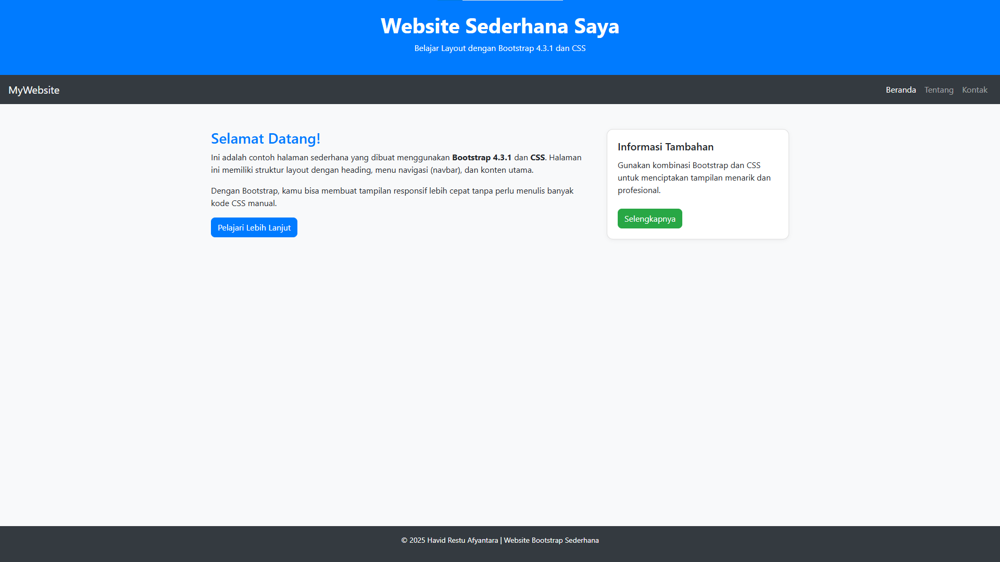

# 🌐 Website Sederhana dengan Bootstrap

Tugas: Membuat **1 halaman sederhana** menggunakan **Bootstrap dan CSS**.

## Struktur Halaman
- Header (judul dan deskripsi)
- Navbar (menu navigasi)
- Konten utama (dua kolom)
- Footer

## Tampilan Website

## Link Repository
[Klik di sini untuk membuka di GitHub]([https://github.com/USERNAME/NAMA-REPO](https://github.com/HavidRa/Website_Sederhana_Dengan_Bootstrap_Dan_CSS)
